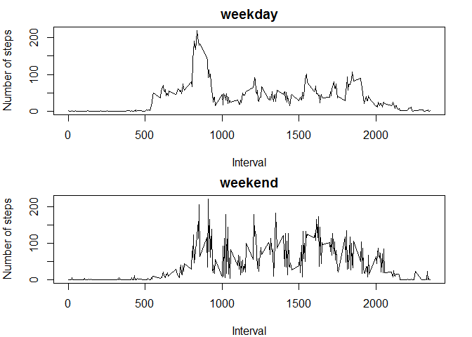

R Markdown
----------

This is an R Markdown document for project 1 in download and load the
files to a datafram

    filename<-"repdata-data-activity.zip"
    if (!file.exists("activity.csv")){
        fileURL <- "https://d396qusza40orc.cloudfront.net/repdata%2Fdata%2Factivity.zip"
        download.file(fileURL, filename)
    }  
    if (!file.exists("activity.csv")) {
        unzip(filename) 
    }
    mydata<-read.csv("activity.csv")

Get the mean of total number of steps taken per day

    step_mean_perday<-tapply(mydata$steps, mydata$date,sum,na.rm=T)
    hist(step_mean_perday,breaks = 30,,xlab = "number of steps per Day",col="red",main = " total number of steps taken per day")

<!-- -->

    print("Mean of step per day ")

    ## [1] "Mean of step per day "

    mean(step_mean_perday)

    ## [1] 9354.23

    print("Median of step per day")

    ## [1] "Median of step per day"

    median(step_mean_perday)

    ## [1] 10395

Get the average daily activity pattern

    step_mean_perinterval<-tapply(mydata$steps, mydata$interval,mean,na.rm=T)
    plot(unique(mydata$interval),step_mean_perinterval,type="l",xlab = "Time/minutes",ylab = " number of steps",main = " average number of steps taken per interval")

<!-- -->

    max_interval<-which.max(step_mean_perinterval)
    print("Maxium of step per interval")

    ## [1] "Maxium of step per interval"

    step_mean_perinterval[max_interval]

    ##      835 
    ## 206.1698

Imputing missing values Replace NAs with average number of steps taken
per interval

    sum_NA<-sum(!complete.cases(mydata))
    step_use<-rbind(unique(mydata$interval),step_mean_perinterval)
    step_use<-t(step_use)
    colnames(step_use)<-c("interval","step mean")
    naused<-mydata[!complete.cases(mydata),]
    aa<-merge(naused,step_use,by="interval",all=T)
    aa$steps<-aa$`step mean`
    newaa<-aa[order(aa$date,aa$interval),]
    newdata<-mydata
    newdata$steps[!complete.cases(mydata)]<-newaa$steps
    sum(!complete.cases(newdata))

    ## [1] 0

    new_step_mean_perday<-tapply(newdata$steps, newdata$date,sum)

plot and get the new mean and median

    hist(new_step_mean_perday,breaks = 30,,xlab = "number of steps per Day",col="red",main = " total number of steps taken per day on impute value")

<!-- -->

    print("Mean of step per day on imputed values ")

    ## [1] "Mean of step per day on imputed values "

    mean(new_step_mean_perday)

    ## [1] 10766.19

    print("Median of step per day on imputed values ")

    ## [1] "Median of step per day on imputed values "

    median(new_step_mean_perday)

    ## [1] 10766.19

Vertify if there are differences in activity patterns between weekdays
and weekends (with filled-in datasets)

    library(lubridate)
    myweek=weekdays(ymd(newdata$date))
    #due to language settings of my computer,the return of function weekdays is Chinese,"星期六" refers to Saturday,"星期日" refers to Sunday
    newdata$week[myweek==c("星期六","星期日")]<-"weekend"
    newdata$week[myweek!=c("星期六","星期日")]<-"weekday"
    s<-split(newdata,newdata$week)
    weekdaystep<-tapply(s$weekday$steps,s$weekday$interval,mean)
    weekendstep<-tapply(s$weekend$steps,s$weekend$interval,mean)
    par(mfrow=c(2,1))
    par(mar=c(4,4,2,2))
    plot(unique(s$weekday$interval),weekdaystep,type = "l",ylab = "Number of steps",xlab = "Interval",main = "weekday")
    plot(sort(unique(s$weekend$interval)),weekendstep,type = "l",ylab = "Number of steps",xlab = "Interval",main = "weekend")

<!-- -->
